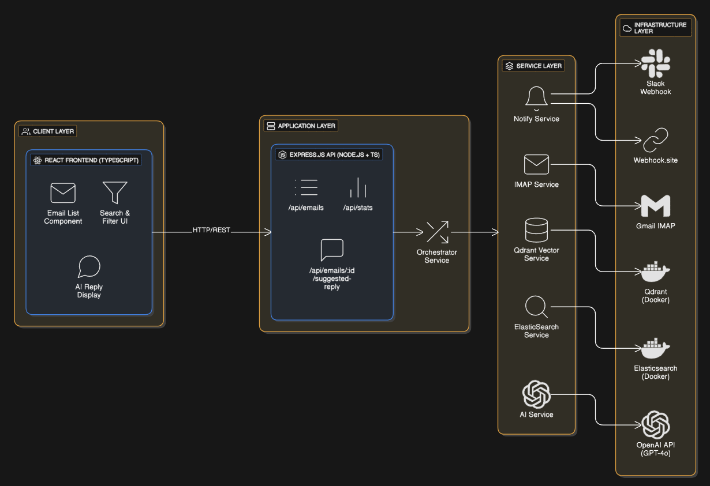

# 📧 Email Onebox - AI-Powered Email Aggregator

A production-ready email aggregator featuring real-time IMAP synchronization, AI-powered categorization, and intelligent reply suggestions using Retrieval-Augmented Generation (RAG).

[](https://www.typescriptlang.org/)
[](https://nodejs.org/)
[](https://reactjs.org/)
[](https://www.docker.com/)
[](https://www.elastic.co/)
[](https://qdrant.tech/)

---

- **Explaination Video Link** - [LOOM](https://www.loom.com/share/3e19ac8227e94898b54a9ea261d638ff)

## 🎯 Project Overview


Email Onebox is a comprehensive email management system that aggregates multiple email accounts into a unified interface with advanced AI capabilities. Built as a full-stack TypeScript application, it demonstrates real-time data synchronization, distributed search, vector databases, and modern frontend development.

**Key Capabilities:**
- 🔄 Real-time email synchronization across multiple IMAP accounts
- 🔍 Full-text search and advanced filtering with Elasticsearch
- 🤖 AI-powered email categorization and reply suggestions
- 📊 Vector-based semantic search with Qdrant
- 🔔 Real-time notifications via Slack and webhooks
- 💡 Modern React UI with Lucide icons

---

## 🏗️ Architecture


The system follows a four-layer architecture pattern:



**Layers:**
1. **Client Layer** - React TypeScript UI
2. **Application Layer** - Express.js REST API
3. **Orchestrator Service** - Coordinates service interactions
4. **Service Layer** - Specialized services (IMAP, AI, Search, Notify, Vector)
5. **Infrastructure Layer** - External services (Gmail, OpenAI, Slack, Docker containers)

---

## ✨ Features

### 1. Real-Time Email Synchronization
- Multi-account IMAP sync (2+ accounts supported)
- 30-day historical email fetch
- Persistent IMAP connections with IDLE mode for instant notifications
- Automatic reconnection and fallback polling (30s intervals)

### 2. Searchable Storage with Elasticsearch
- Docker-hosted Elasticsearch instance
- Full-text search across subject, body, and sender
- Advanced filtering by folder, account, and category
- Optimized indexing with keyword fields for aggregations
- Real-time stats and category breakdowns

### 3. AI-Based Email Categorization
- Intelligent categorization into multiple categories:
  - **Work** - Professional communications
  - **Personal** - Personal messages
  - **Promotions** - Marketing emails
  - **Social** - Social media notifications
  - **Updates** - Product/system updates
  - **Forums** - Discussion threads
  - **Spam** - Unwanted content
  - **Important** - Priority emails
  - **Finance** - Financial transactions
  - **Travel** - Travel itineraries
  - **Shopping** - Purchase confirmations
  - **Health** - Health-related content
- Real-time categorization on email arrival
- Visual icon indicators using Lucide React icons

### 4. Slack & Webhook Integration
- Slack notifications for categorized emails
- Rich message formatting with email preview
- Webhook triggers for external automation
- Configurable notification rules

### 5. Modern Frontend Interface
- React TypeScript with Tailwind CSS
- Real-time email display
- Advanced search and filtering
- Pagination with "Load More" functionality
- Category-based filtering with visual indicators
- Responsive design with independent scrollable sections
- Lucide React icons for modern UI

### 6. AI-Powered Suggested Replies (RAG)
- Qdrant vector database for context storage
- OpenAI embeddings for semantic search
- Context-aware reply generation
- Automatic meeting link inclusion
- One-click copy to clipboard

---

## 📁 Directory Structure

```
email-onebox/
├── backend/                     # Node.js + TypeScript backend
│   ├── src/
│   │   ├── config/             # Configuration files
│   │   │   ├── env.ts         # Environment variables
│   │   │   ├── elasticsearch.ts
│   │   │   └── index.ts
│   │   ├── models/             # Data models
│   │   │   └── Email.ts
│   │   ├── routes/             # API endpoints
│   │   │   └── index.ts
│   │   ├── services/           # Core services
│   │   │   ├── ai.service.ts         # OpenAI integration
│   │   │   ├── elasticsearch.service.ts
│   │   │   ├── imap.service.ts      # Email sync
│   │   │   ├── notification.service.ts
│   │   │   ├── orchestrator.service.ts
│   │   │   └── qdrant.service.ts
│   │   └── types/             # TypeScript types
│   │       └── index.ts
│   ├── package.json
│   └── tsconfig.json
│
├── frontend/                    # React + TypeScript frontend
│   ├── src/
│   │   ├── components/        # React components
│   │   │   ├── CategoryStats.tsx
│   │   │   ├── EmailDetail.tsx
│   │   │   ├── EmailItem.tsx
│   │   │   ├── EmailList.tsx
│   │   │   └── Sidebar.tsx
│   │   ├── utils/            # Utilities
│   │   │   └── helpers.tsx  # Helper functions with Lucide icons
│   │   ├── types/            # TypeScript types
│   │   │   └── index.ts
│   │   ├── App.tsx
│   │   ├── index.tsx
│   │   └── index.css
│   ├── public/               # Static assets
│   ├── package.json
│   └── tsconfig.json
│
├── docker-compose.yml        # Docker services (Elasticsearch, Qdrant)
├── architecture.png          # Architecture diagram
├── onebox1.png              # Screenshots
├── onebox2.png
├── onebox3.png
├── onebox4.png
└── README.md
```

---

## 🚀 Setup & Installation

### Prerequisites
- Node.js (v18+)
- Docker and Docker Compose
- Gmail account(s) with IMAP enabled
- OpenAI API key
- (Optional) Slack webhook URL

### Step 1: Clone the Repository
```bash
git clone https://github.com/yourusername/email-onebox.git
cd email-onebox
```

### Step 2: Install Dependencies

**Backend:**
```bash
cd backend
npm install
```

**Frontend:**
```bash
cd ../frontend
npm install
```

### Step 3: Configure Environment Variables

Create a `.env` file in the `backend` directory:

```env
# Server Configuration
PORT=3000
NODE_ENV=development

# Email Configuration (IMAP)
IMAP_ACCOUNT_1_EMAIL=your-email@gmail.com
IMAP_ACCOUNT_1_PASSWORD=your-app-password
IMAP_ACCOUNT_1_HOST=imap.gmail.com
IMAP_ACCOUNT_1_PORT=993

# Optional: Second account
IMAP_ACCOUNT_2_EMAIL=second-email@gmail.com
IMAP_ACCOUNT_2_PASSWORD=app-password
IMAP_ACCOUNT_2_HOST=imap.gmail.com
IMAP_ACCOUNT_2_PORT=993

# OpenAI Configuration
OPENAI_API_KEY=sk-your-openai-api-key

# Optional: Slack Integration
SLACK_WEBHOOK_URL=https://hooks.slack.com/services/YOUR/WEBHOOK/URL

# Optional: Custom Webhook
WEBHOOK_URL=https://webhook.site/your-unique-id

# Product Information for RAG
PRODUCT_INFO=Your product description here
MEETING_LINK=https://calendly.com/yourmeeting
```

**📝 Note for Gmail:**
- Enable "Less secure app access" or use an App Password
- Generate an app password: Google Account → Security → App passwords

### Step 4: Start Docker Services

```bash
# Start Elasticsearch and Qdrant
docker-compose up -d

# Verify services are running
docker-compose ps
```

### Step 5: Start the Backend

```bash
cd backend
npm run dev
```

The backend will start on `http://localhost:3000`

### Step 6: Start the Frontend

```bash
cd frontend
npm start
```

The frontend will start on `http://localhost:3001`

---

## 📖 Usage

### Accessing the Application

1. Open your browser and navigate to `http://localhost:3001`
2. The application will automatically start syncing emails from configured IMAP accounts
3. Wait for the initial sync to complete (fetches last 30 days of emails)

### Features Usage

#### 1. **Email Viewing**
- Browse all synced emails in the center panel
- Click on any email to view details in the right panel

#### 2. **Search & Filter**
- Use the search bar in the sidebar to search across subject, body, and sender
- Filter by account using the dropdown
- Filter by category using the category dropdown
- Click "Apply" to apply filters

#### 3. **Category Statistics**
- View category breakdown in the sidebar
- Click on any category to filter emails by that category
- See email counts per category

#### 4. **AI Suggested Replies**
- Click on any email to view details
- The AI will automatically generate a contextual reply
- Click "Copy to Clipboard" to copy the suggested reply

#### 5. **Real-Time Updates**
- New emails are automatically synced via IMAP IDLE mode
- Statistics and counts update in real-time
- No need to refresh the page

---

## 🖼️ Screenshots

### Overview Dashboard


### Email List with Categories


### AI Reply Generation


### Category Filters


### AI Reply Generation


---

## 🔧 Configuration

### Email Accounts

Add multiple IMAP accounts by extending the configuration in `backend/src/config/env.ts`:

```typescript
imap: {
  accounts: [
    {
      id: 'account1',
      email: process.env.IMAP_ACCOUNT_1_EMAIL,
      password: process.env.IMAP_ACCOUNT_1_PASSWORD,
      host: process.env.IMAP_ACCOUNT_1_HOST || 'imap.gmail.com',
      port: parseInt(process.env.IMAP_ACCOUNT_1_PORT || '993'),
      tls: true
    },
    // Add more accounts...
  ]
}
```

### Categories

Categories can be customized in the AI service. Edit `backend/src/services/ai.service.ts`:

```typescript
const categories = [
  'Work',
  'Personal',
  'Promotions',
  'Social',
  // Add more categories...
];
```

### Notification Rules

Configure notification triggers in `backend/src/services/notification.service.ts`:

```typescript
// Example: Only notify for "Important" category
if (email.category === 'Important') {
  await this.sendSlackNotification(email);
}
```

---

## 🛠️ Development

### Running in Development Mode

**Backend with auto-reload:**
```bash
cd backend
npm run dev
```

**Frontend with hot reload:**
```bash
cd frontend
npm start
```

### Building for Production

**Backend:**
```bash
cd backend
npm run build
npm start
```

**Frontend:**
```bash
cd frontend
npm run build
# Serve the build folder with a static server
npx serve -s build
```

---

## 🧪 Testing

### Testing Email Sync
1. Send a test email to one of your configured accounts
2. Wait up to 30 seconds for IMAP polling to catch the new email
3. Verify the email appears in the UI

### Testing AI Categories
1. Send emails with specific keywords (e.g., "meeting", "urgent")
2. Verify proper categorization in the stats panel

### Testing Search
1. Use the search bar to find specific emails
2. Test filters (account, category)
3. Verify aggregated statistics update correctly

---

## 🐛 Troubleshooting

### Backend won't start
- Ensure Docker services are running: `docker-compose ps`
- Check `.env` file has all required variables
- Verify Elasticsearch is accessible at `http://localhost:9200`

### Emails not syncing
- Verify IMAP credentials are correct
- Check if "Less secure apps" is enabled in Google Account
- Use an App Password instead of regular password
- Check backend logs for IMAP connection errors

### Frontend showing no data
- Verify backend is running on port 3000
- Check browser console for API errors
- Ensure Elasticsearch has data: `curl http://localhost:9200/emails/_count`

### Docker services issues
- Restart services: `docker-compose restart`
- Check logs: `docker-compose logs elasticsearch`
- Rebuild if needed: `docker-compose up -d --build`

---

## 📊 Tech Stack

| Layer | Technology |
|-------|-----------|
| Frontend | React 18, TypeScript, Tailwind CSS, Lucide Icons, Axios |
| Backend | Node.js, Express.js, TypeScript |
| Database | Elasticsearch 8.11.0, Qdrant |
| AI/ML | OpenAI GPT-4o, Embeddings |
| Email | IMAP (node-imap) |
| Containerization | Docker, Docker Compose |
| Build Tools | TypeScript, Webpack, Tailwind |

---

## 🤝 Contributing

Contributions are welcome! Please feel free to submit a Pull Request.

1. Fork the repository
2. Create your feature branch (`git checkout -b feature/AmazingFeature`)
3. Commit your changes (`git commit -m 'Add some AmazingFeature'`)
4. Push to the branch (`git push origin feature/AmazingFeature`)
5. Open a Pull Request

---

## 📝 License

This project is licensed under the MIT License - see the LICENSE file for details.

---

## 👥 Authors

- **Shriram** - [GitHub](https://github.com/ShriramNarkhede)

---

## 🙏 Acknowledgments

- OpenAI for GPT-4o API
- Elasticsearch for powerful search capabilities
- Qdrant for vector database
- Lucide for beautiful icons
- The open-source community

---

**Made with ❤️ using AI-powered email management**